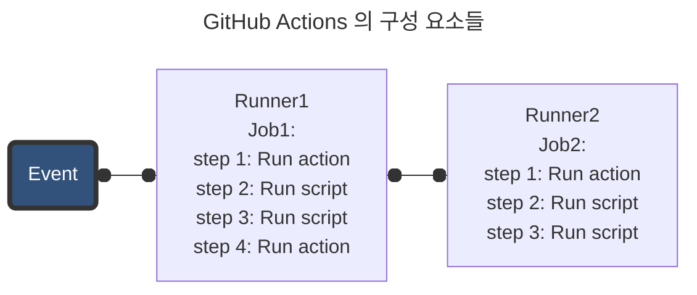

# GitHub Actions

- GitHub 에서 제공하는 클라우드형 CI/CD 툴
- GitHub repository 와 쉽게 연동하여 CI/CD 까지 함께 구축하고 관리할 수 있다.
- public repository 라면 무료로 사용할 수 있다.

## 1. 구성요소



### 1.1. Workflow

- github action 상 실행될 자동화된 일련의 작업 흐름. YAML 형식 파일로 설정
- repository 안에서 발생하는 이벤트나 예약된 스케줄에 의해서 실행될 수 있으며, 직접 수동으로 실행할 수도 있음

### 1.2. Event

- repository 에서 발생하는 push, PR open, issue open 등 특정 활동
- 특정 이벤트 발생 시 그에 맞는 CI/CD 파이프라인을 구동하도록 설정 가능

### 1.3. Jobs

- 하나의 runner 에서 실행될 여러 steps 의 모음
- step 는 실행 가능한 하나의 shell script 또는 action 을 의미
- job 안의 step 들은 순차적으로 실행
- workflow의 job 들은 기본적으로 병렬 실행되나, 일부 job 을 다른 job 에 의존성을 설정해서 그 job 이 완료된 후 실행되도록 설정 가능

### 1.4. Actions

- GitHub workflow 에서 자주 사용되는 기능들을 모아둔 일종의 커스텀 애플리케이션
- 설정 파일에서 `use` 키워드와 함께 사용 가능
- branch checkout, 환경 설정 등 복잡하지만 자주 사용되는 과정들을 미리 정의해두고 활용할 수 있음
- GitHub Marketplace 에서 Action 을 검색하여 활용 가능

### 1.5. Runner

- workflow 를 실행하는 서버
- 클라우드형 CI/CD 플랫폼인 GitHub Actions 는 직접 컴퓨터를 관리하지 않고 가상의 Runner 를 통해 Workflow 를 실행
- 기본적으로 Node 16 version 탑재

## 2. CI/CD 로 구축할 과정

1. master branch 에 push 또는 pull request merge 가 발생하면 workflow 를 실행
2. 필요한 dependency 들 설치
3. build script 실행
4. aws 에 접속한 후 s3 bucket 에 build 결과물 업로드

### 2.1. YAML 파일 세팅

- .github/workflows/ 폴더 생성 후 CICD.yml 파일 생성

```yml
name: CI/CD

on:
  push:
    branches:
      - master
  workflow_dispatch:

jobs:
  cicd:
    runs-on: ubuntu-latest
    steps:
      - uses: actions/checkout@v3
        with:
          ref: 'master'
      - run: npm ci
      - run: npm run test
      - run: npm run build
      - name: deploy to s3
        uses: jakejarvis/s3-sync-action@master
        with:
          args: --delete
        env:
          AWS_S3_BUCKET: ${{ secrets.AWS_S3_BUCKET }}
          AWS_ACCESS_KEY_ID: ${{ secrets.AWS_ACCESS_KEY_ID }}
          AWS_SECRET_ACCESS_KEY: ${{ secrets.AWS_SECRET_ACCESS_KEY }}
          AWS_REGION: 'ap-northeast-2'
          SOURCE_DIR: 'build'
```

- name: workflow 의 이름
- on: 언제 실행될 것인가?

  - push: push 되었을 때
    - branches: 해당 branch 에
  - workflow_dispatch: 수동으로 실행  
    (actions -> Run workflow 버튼 클릭으로 실행)

- jobs: 각 job 의 이름과 그 동작을 하위에 작성

  - ...: job 의 이름

    - runs-on: runner 의 이름
    - steps: 무엇을 하는가? -(dash) 로 각 step 구분

      - name: repo Actions 탭에서 표시할 step 의 이름
      - run: 실행할 스크립트
      - uses: marketplace 의 action 라이브러리명
      - with: 해당 action 의 옵션값 하위에 나열  
         (해당 action 의 공식 문서 참조)

        - ref: branch 명
        - args: --delete (기존 파일들 삭제)

      - env: 환경변수 설정. `${{ secrets.<variable> }}`
        - AWS_S3_BUCKET: repo 환경변수의 bucket 이름 변수명
        - AWS_ACCESS_KEY_ID: repo 환경변수의 액세스 키 변수명
        - AWS_SECRET_ACCESS_KEY: repo 환경변수의 비밀 액세스 키 변수명
        - AWS_REGION: 리전
        - SOURCE_DIR: build 할 폴더명

### 2.2. GitHub repository 환경변수 세팅

- repo 의 Settings => Secrets and variables => Actions 에 들어가서 환경변수 세팅 가능
- ! 기존에 저장된 환경변수의 값은 다시 볼 수 없고, 재설정만 가능

  1. New repository secret 버튼 클릭
  2. `AWS_S3_BUCKET`, `AWS_ACCESS_KEY_ID`, `AWS_SECRET_ACCESS_KEY` 변수명으로 각각 bucket 이름, 액세스 키, 비밀 액세스 키 입력

### 2.3. branch 에 push

- 이제 push 가 발생하면 세팅한 workflow 가 자동 실행된다.
- 다른 repository 로 checkout 한 다음 실행도 가능하다.
